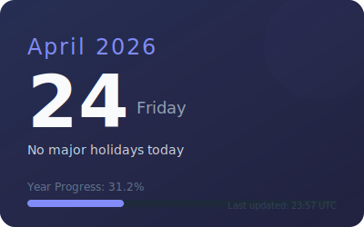

# Hi there! 👋 I'm Yung71nKzH3

Welcome to my corner of GitHub. Keeping track of the days and celebrating the moments.

  

---

### 🗓️ Today's Outlook
The calendar above updates every hour to show the current date, any holidays happening today, and how much of the year we've navigated so far.

---

<b>About this Calendar</b>

This is a dynamic SVG display powered by Python, the `holidays` library, and GitHub Actions. It helps me stay mindful of time and celebrate global events!

